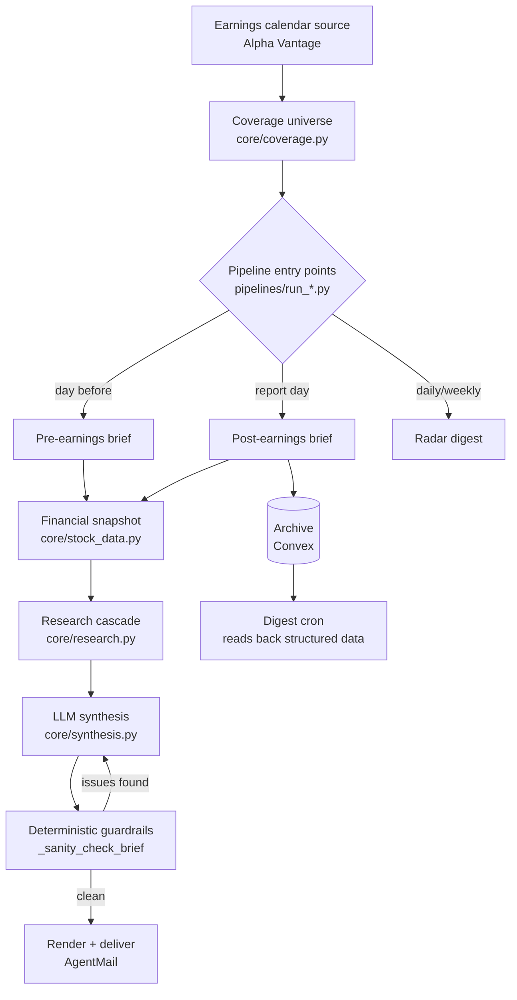

# Earnings Intelligence Pipeline

An automated, LLM-grounded earnings research pipeline: it watches a coverage universe of tickers, writes pre- and post-earnings briefs by combining live financial data with web-search-grounded synthesis, and emails them out on a schedule — all running as stateless scheduled jobs with no server to maintain.

This repo is a cleaned-up, genericized extract of a system that has been running in production for a real (but here, unnamed) investment fund's own earnings coverage since mid-2026. The code is real; the fund name, portfolio holdings, and account-specific identifiers have been replaced with placeholders (see [Porting this to your own use case](#porting-this-to-your-own-use-case)).

**The part worth reading if you're short on time is [The guardrail patterns](#the-guardrail-patterns), not the pipeline plumbing.** Wiring an LLM to a web-search tool and asking it to write a financial summary is the easy 80%. Getting a system to stop confidently stating the wrong fiscal quarter, the wrong year, or a segment revenue figure it half-remembers from stale training data — reliably, unattended, at 6am before anyone's awake to catch it — is the actual engineering problem this repo is about.

## What it does

- **Pre-earnings briefs** — sent the morning before a company reports: prior-quarter actuals, Street consensus for the upcoming quarter, CapEx trajectory, official links.
- **Post-earnings briefs** — sent the same day a company reports, session-aware (before-open vs. after-close reporters get processed and delivered at different times so the price reaction shown is actually settled, not a snapshot from the wrong session).
- **Daily/weekly radar digests** — a scan across the whole coverage universe for what's reporting soon and what matters.
- **Structured historical archive** — every post-earnings brief writes comparable, structured figures (revenue, EPS, CapEx guide-vs-actual) to a shared store, not just prose, so quarter-over-quarter and sector-level trend queries are possible later without re-parsing old emails.

## Architecture



| Layer | File(s) | Role |
|---|---|---|
| Coverage & sector tagging | `core/coverage.py` | Ticker → sector / portfolio-company mapping, queryable at write time |
| Live financial facts | `core/stock_data.py` | yfinance-sourced snapshots: prior-quarter actuals, consensus, **dated anchors** used to verify the LLM's own research (see guardrails) |
| Research | `core/research.py` | Multi-provider search cascade (LLMLayer → Tavily → TinyFish → optional Exa) with graceful degradation; also fetches and extracts real transcript/press-release text, not just snippets |
| Synthesis + guardrails | `core/synthesis.py` | The core: structured-output LLM synthesis, an LLM review pass, and a **deterministic** sanity-check layer independent of the LLM (this is the file to read first) |
| Rendering & delivery | `pipelines/render_*.py`, `pipelines/agentmail_delivery.py` | HTML/markdown email rendering, citation extraction, send via AgentMail |
| Cross-cron archive | `pipelines/earnings_archive.py`, `convex/` | Structured historical storage — necessary because scheduled cron containers are stateless and don't share a filesystem between runs (see below) |
| Scheduling | `pipelines/run_*.py`, `render.yaml.example` | Entry points + an example Render Blueprint cron layout |

### Why a hosted archive, not just files

Every pre/post-earnings script writes its output locally too, but that's not the real persistence layer. **Serverless cron platforms give each scheduled run its own fresh, ephemeral container — two crons running 30 minutes apart do not share a filesystem.** This was discovered the hard way: a digest cron designed to read files written by an earlier cron that same morning always fell back to a degraded, LLM-free summary in production, because the file simply wasn't there. The fix was a real hosted document store (this project uses Convex; Supabase/DynamoDB/hosted Postgres would work identically) that every cron writes to and any cron can read from, keyed by ticker + report date.

### Two same-day digests, not one mixed one

An earlier design sent a single daily digest that combined *today's* before-open reporters with the *prior evening's* after-close reporters. The after-close reporters' price-reaction percentage was a snapshot frozen at whenever the previous evening's cron happened to run — which reads as stale and simply wrong by the time anyone opens the email the next morning, especially for a stock that kept moving overnight. The fix: split into two same-day digests (`--session bmo` / `--session amc`), and re-fetch every reaction percentage live at digest-send time instead of trusting an archived value at all.

## The guardrail patterns

These are the reusable lessons, generalized from specific production incidents. Each one exists because a plausible-sounding, LLM-generated number turned out to be wrong in a way that a deterministic, non-LLM check could catch — the pattern that recurs throughout this codebase is **the LLM reviewer catching its own mistake is not the same as the mistake getting fixed**; a second automated pass with the same LLM regenerating the same wrong figure was observed live more than once. `_sanity_check_brief()` in `core/synthesis.py` is the accumulated result.

1. **Never trust an undated label as if it were dated.** A "next quarter" consensus estimate with no attached period-end date will silently misalign for any company whose fiscal year doesn't match the calendar (a report in late July can be a company's fiscal Q4, not calendar Q2/Q3). Fix: compute a deterministic, *dated* anchor from data that does have a real date (last actually-reported period-end + 3 months), and require the model to state its own researched period, cross-checked against that anchor with a tolerance window.

2. **A correct quarter label doesn't guarantee period-matched figures.** Getting the label right is necessary but not sufficient — the specific actual/consensus numbers being compared must both be for that same verified period, or a "beat/miss" framing is meaningless. Enforced via an explicit two-step research instruction (confirm the period, *then* verify every figure is for it) plus a deterministic check on the divergence between stated actual and consensus.

3. **Calendar-year vs. fiscal-year is a distinct trap for financial guidance figures specifically.** Press coverage frequently quotes CapEx guidance for a calendar year while the rest of a brief is fiscal-year framed — an easy, silent ~10-40% error. Fixed with dated fiscal-year anchors (last fiscal year's actual, current fiscal year's already-reported quarters summed) the model can check new figures against, plus an explicit instruction to label calendar-year figures as such rather than presenting them as fiscal-year.

4. **A guidance number changing doesn't always mean the underlying plan changed.** A CapEx guide that appears to drop 8% quarter-over-quarter can be a pure accounting reclassification (e.g., leases shifting between finance and operating treatment) with the real investment plan explicitly unchanged. The fix isn't a number check — it's an instruction to search for *why* a guidance figure moved before characterizing it as a raise or cut.

5. **Company guidance and analyst estimates are different numbers; collapsing them loses information.** A dedicated structured field for the Street estimate, distinct from the company's own guide, lets a brief report both when management guides meaningfully above or below what the Street had modeled — itself often the most interesting data point.

6. **A magnitude that's structurally impossible is a free, high-confidence check.** A single business segment's revenue can never legitimately exceed total company revenue. Any dollar figure in a "revenue" bullet exceeding the known total by more than ~5% is definitionally wrong, regardless of source — no LLM judgment needed to catch it.

7. **Segment/product-line figures are more prone to stale-recall hallucination than top-line figures.** A model can get total revenue right (proving it searched) while getting a specific segment figure wrong by nearly 50% — evidently recalled from an earlier reporting period rather than actually searched for the current one, self-consistently propagated into derived percentages so it never looks internally contradictory. The fix that actually works is procedural, not a number check: require a dedicated, specific search per segment figure (`"{company} {segment} revenue Q{n} {year}"`, not general recall), sanity-checked against the already-known total.

8. **Structured-field correctness does not guarantee the reader ever sees it.** A guide-vs-prior CapEx comparison can be perfectly correct in the structured JSON output while completely absent from the rendered prose a human actually reads, because nothing checked that the two stayed in sync. The fix generalizes past this one field: whenever a prompt instruction produces both a structured value and prose that's supposed to state it, verify the *prose* independently — never assume structured correctness implies the reader-facing output says anything at all.

9. **A brief can have accurate figures and still ship with zero visible sourcing.** Official links (press release / investor deck / transcript) and inline citations are populated by two entirely separate mechanisms — a schema field vs. a regex extracting a specific inline-citation pattern from prose — and neither is guaranteed just because web search happened. Investigated (and ruled out) using the LLM API's own native citation metadata as a more reliable alternative: OpenAI's Responses API does return real `url_citation` annotations when using web search in plain-text mode, but **strict JSON-schema structured output mode suppresses those annotations entirely** — confirmed via a direct side-by-side API test. So citations can only come from the model choosing to embed them as literal text inside a string field; a deterministic check requiring at least one of (official link, inline citation) backstops the prompt instruction without demanding perfect compliance the API can't guarantee.

10. **Real primary-source text beats search snippets — but grounding a model in too much of it backfires.** Search providers were already capable of returning full page content, but a display-layer truncation (a ~280-character snippet limit, applied indiscriminately) meant no amount of prompt tuning could help, because the actual source text never reached the model in the first place. Fixing that surfaced two more lessons: (a) a query built around a generic identifier (e.g. just a date) can match a completely unrelated entity — verify the fetched content actually mentions the target company, don't trust title/URL matching alone; (b) injecting an entire ~40k-character document into a structured-output prompt broke JSON generation entirely (empty output) — a small, keyword-focused excerpt around the relevant terms works far more reliably than either a snippet or a full-document dump.

11. **Live market-data fields need to be selected by what session is actually live, not a fixed priority order.** A fixed "postmarket → regular → premarket" field-read order works right after a report drops, but the morning after, postmarket data has gone `None` and the same order silently falls through to a stale pre-report "regular session" figure — while the correct, live premarket figure sits one step further down, never reached. Fix: drive field selection off the data provider's own live market-state indicator, not an assumption about when the code happens to run.

12. **When you know a specific figure is wrong and have the correct one, anchor it explicitly rather than re-running the pipeline and hoping.** A generic retry (even with a strengthened prompt) can drift to a *different* wrong answer — one retry attempt ended up citing an entirely wrong fiscal year across every source URL. A targeted correction that states the verified figure directly and forbids substituting a different one is far more reliable than trusting an unguided retry to land correctly twice in a row.

## Porting this to your own use case

This isn't packaged as a pip-installable library — it's a reference implementation meant to be forked and edited. The places to touch:

- **Coverage universe**: `pipelines/run_earnings_radar_automation.py` (`DEFAULT_COVERAGE_UNIVERSE`) and `core/coverage.py` (`_INDIVIDUAL_SECTORS`, `PORTCO_TICKERS`) both currently contain illustrative placeholder tickers where a real fund's portfolio-company list would go — replace with your own.
- **Research providers**: `core/research.py`'s cascade (`run_research_query_cascade`) is provider-agnostic by design — each `search_*()` function returns the same normalized shape, so swapping or adding a provider means adding one function and one line in the cascade, not touching call sites.
- **Delivery**: `pipelines/agentmail_delivery.py` is the only file that knows about AgentMail specifically. Swapping to SES, Postmark, or SMTP means replacing this one module — everything upstream produces an HTML string and a recipient list, provider-agnostic.
- **Archive store**: `pipelines/earnings_archive.py` + `convex/` assume Convex, but the actual contract is small (write a structured summary keyed by ticker+date, read back by date or by ticker) — porting to Supabase/Postgres/DynamoDB means reimplementing that one file's handful of functions.
- **Scheduling**: `render.yaml.example` assumes Render; the entry-point scripts themselves have zero Render-specific code (they're plain CLI scripts reading env vars), so any cron-capable platform works — GitHub Actions scheduled workflows, a plain crontab, AWS EventBridge + Lambda, etc.
- **Guardrails**: `_sanity_check_brief()` in `core/synthesis.py` is where you'd add a new deterministic check for a failure mode specific to your own coverage universe. The pattern to follow (see [above](#the-guardrail-patterns)): get a real, dated ground-truth fact wherever possible, add explicit prompt language, then add a deterministic backstop — don't rely on the LLM reviewer catching its own class of error reliably.

## Setup

```bash
pip install -r requirements.txt
cp .env.example .env.local   # fill in your own keys; never commit this file
```

Required for anything to run meaningfully: `OPENAI_API_KEY` (synthesis), `AGENTMAIL_API_KEY` + `AGENTMAIL_INBOX_ID` (delivery — or swap in your own provider), `ALPHA_VANTAGE_API_KEY` (earnings calendar). Everything else in `.env.example` degrades gracefully when unset (fewer research providers in the cascade, no archive, etc.) rather than failing outright — see the comments in that file for what each one gates.

Run a single pipeline locally, e.g.:

```bash
python pipelines/run_pre_earnings_deep_dive_auto.py \
  --calendar-csv data/latest_earnings_calendar.csv \
  --draft-only
```

`--draft-only` builds the email artifacts without sending — useful for iterating on prompts/guardrails without spending on delivery.

## Known limitations & roadmap

See [ROADMAP.md](ROADMAP.md).

## License

MIT — see [LICENSE](LICENSE).
