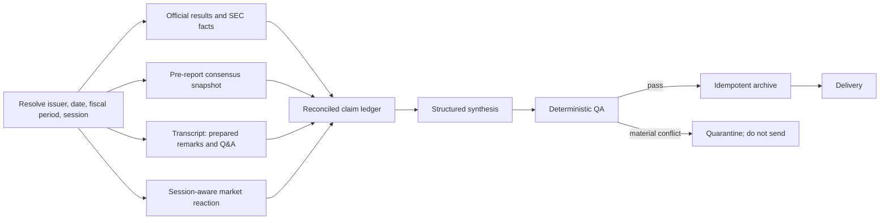

# Earnings research orchestration

`core/earnings_orchestration.py` is the provider-neutral contract for an earnings run. It answers two separate questions:

1. What evidence must exist before a brief can be trusted?
2. How should a durable runner sequence, retry, degrade, and publish that work?

Generate a concrete plan without making external calls:

```powershell
python pipelines/plan_earnings_research.py `
  --ticker IBM `
  --company "International Business Machines" `
  --report-date 2026-10-21 `
  --report-time AMC `
  --mode post
```

## Provider policy

LLMLayer is always attempted first. Search-result discovery then falls through to Tavily and TinyFish. Full-document and transcript retrieval falls through to TinyFish before Tavily because the important success condition is substantial page text, not another short result snippet. Exa remains an explicit opt-in immediately behind LLMLayer.

A provider failure is an observation, not a workflow failure. Authentication and quota responses such as HTTP 432/433 should open a circuit for that provider for the rest of the run and immediately continue down the waterfall. HTTP 429 and transient network failures may be retried with bounded backoff. The run only fails when a required evidence gate remains unsatisfied after the entire waterfall.

## Evidence flow



Revenue and EPS actuals come from filed or company-issued primary sources. Consensus comes from a timestamped snapshot captured before the report. Transcript text explains why results or guidance changed but does not replace the authoritative financial fact layer. Prepared remarks and analyst Q&A stay separate so management's script and challenged answers can be compared explicitly.

## Cloudflare Workflow mapping

This mapping follows Cloudflare's [Rules of Workflows](https://developers.cloudflare.com/workflows/build/rules-of-workflows/): keep steps granular and idempotent, keep side effects inside steps, and await every step. Large or long-lived source artifacts should be stored externally and represented in Workflow state by a reference.

- The scheduled Worker should only identify eligible events and create Workflow instances. Use a stable composite ID such as `earnings-ibm-2026-10-21-post-v1` so duplicate cron invocations cannot duplicate the run.
- Map each external provider call, archive write, and delivery to its own `step.do()`. A later failure should not repay for earlier successful provider calls.
- Use retryable errors only for transient failures. Treat invalid credentials, quota exhaustion, and failed evidence gates as non-retryable at that provider step; the waterfall decision is a separate deterministic step.
- Store complete releases, decks, and transcripts in durable object storage and return a small content reference plus hash from the step. Keep only focused excerpts and structured facts in Workflow state.
- Archive with the same event/version idempotency key before delivery. Delivery must check the archive and prior delivery state before sending.
- Emit structured stage telemetry: event ID, stage, provider, attempt, latency, result count, degradation reason, evidence-gate result, and final disposition. Never log source text, prompts containing confidential context, or secrets.
- Start in shadow mode. Compare the new claim ledger and final brief with the current Python output before enabling native sends.

The current Python cron jobs can consume the same plan incrementally. The first integration points are the provider ordering in `core/research.py`, transcript caching, and the existing deterministic checks in `core/synthesis.py`.
